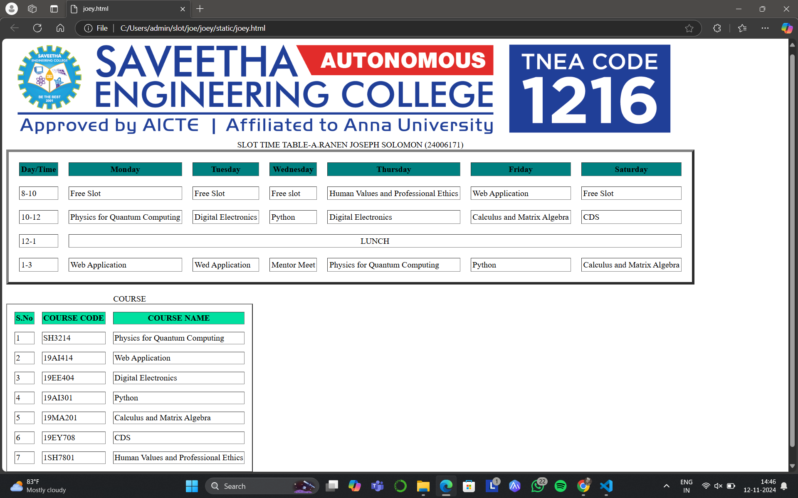
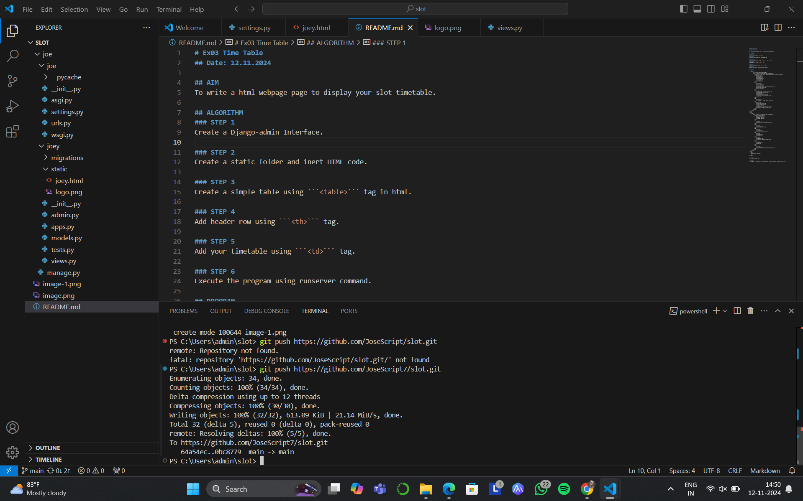

# Ex03 Time Table
## Date: 12.11.2024

## AIM
To write a html webpage page to display your slot timetable.

## ALGORITHM
### STEP 1
Create a Django-admin Interface.

### STEP 2
Create a static folder and inert HTML code.

### STEP 3
Create a simple table using ```<table>``` tag in html.

### STEP 4
Add header row using ```<th>``` tag.

### STEP 5
Add your timetable using ```<td>``` tag.

### STEP 6
Execute the program using runserver command.

## PROGRAM
```
<html>
    <body>
        
        <table border="5" cellspacing="20" cellpadding="3">
            <caption>SLOT TIME TABLE-A.RANEN JOSEPH SOLOMON (24006171)</caption>
            <tr bgcolor="Teal">
                <th>Day/Time</th>
                <th>Monday</th>
                <th>Tuesday</th>
                <th>Wednesday</th>
                <th>Thursday</th>
                <th>Friday</th>
                <th>Saturday</th>
            </tr>
            <tr>
                <td>8-10</td>
                <td>Free Slot</td>
                <td>Free Slot</td>
                <td>Free slot</td>
                <td>Human Values and Professional Ethics</td>
                <td>Web Application</td>
                <td>Free Slot</td>
            </tr>
            <TR>
                <td>10-12</td>
                <td>Physics for Quantum Computing</td>
                <td>Digital Electronics</td>
                <td>Python</td>
                <td>Digital Electronics</td>
                <td>Calculus and Matrix Algebra</td>
                <td>CDS</td>

            </TR>
            <TR>
                <td>12-1</td>
                <td colspan="6" align="center">LUNCH</td>
            </TR>
            <TR>
                <td>1-3</td>
                <td>Web Application</td>
                <td>Wed Application</td>
                <td>Mentor Meet</td>
                <td>Physics for Quantum Computing</td>
                <td>Python</td>
                <td>Calculus and Matrix Algebra</td>
            </TR>
        </table>
    </body>
</html>
<br>
<html>
    <body>
        <table border="2" cellspacing="15" cellpadding="2">
            <caption>COURSE</caption>
            <tr bgcolor="Slate gray">
                <th>S.No</th>
                <th>COURSE CODE</th>
                <th>COURSE NAME</th>
            </tr>
            <tr>
                <td>1</td>
                <td>SH3214 </td>
                <td>Physics for Quantum Computing</td>
            </tr>
            <TR>
                <td>2</td>
                <td>19AI414 </td>
                <td>Web Application</td>
            </TR>
            <TR>
                <td>3</td>
                <td>19EE404</td>
                <td>Digital Electronics</td>
            </TR>
            <TR>
                <td>4</td>
                <td>19AI301</td>
                <td>Python</td>
            </TR>
            <TR>
                <td>5</td>
                <td>19MA201 </td>
                <td>Calculus and Matrix Algebra</td>
            </TR>
            <TR>
                <td>6</td>
                <td>19EY708</td>
                <td>CDS</td>
            </TR>
            <TR>
                <td>7</td>
                <td>1SH7801</td>
                <td>Human Values and Professional Ethics</td>
            </TR>
        </table>
    </body>
</html>
<style>
    body{
    font-family: 'poppine';
    }
</style>
```

## OUTPUT



## RESULT
The program for creating slot timetable using basic HTML tags is executed successfully.
